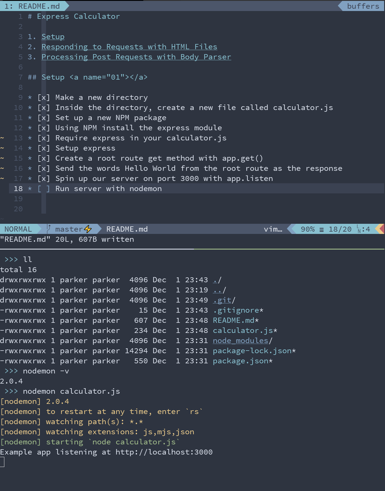
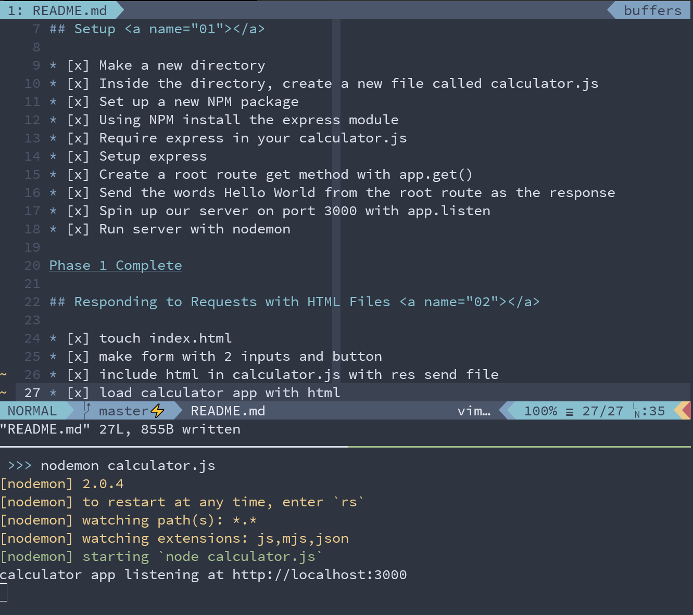

# Express Calculator

1. [Setup](#01)
2. [Responding to Requests with HTML Files](#02)
3. [Processing Post Requests with Body Parser](#03)

## Setup 

* [x] Make a new directory
* [x] Inside the directory, create a new file called calculator.js
* [x] Set up a new NPM package
* [x] Using NPM install the express module
* [x] Require express in your calculator.js
* [x] Setup express
* [x] Create a root route get method with app.get()
* [x] Send the words Hello World from the root route as the response
* [x] Spin up our server on port 3000 with app.listen
* [x] Run server with nodemon

## Responding to Requests with HTML Files 

* [x] touch index.html
* [x] make form with 2 inputs and button
* [x] include html in calculator.js with res send file
* [x] load calculator app with html

